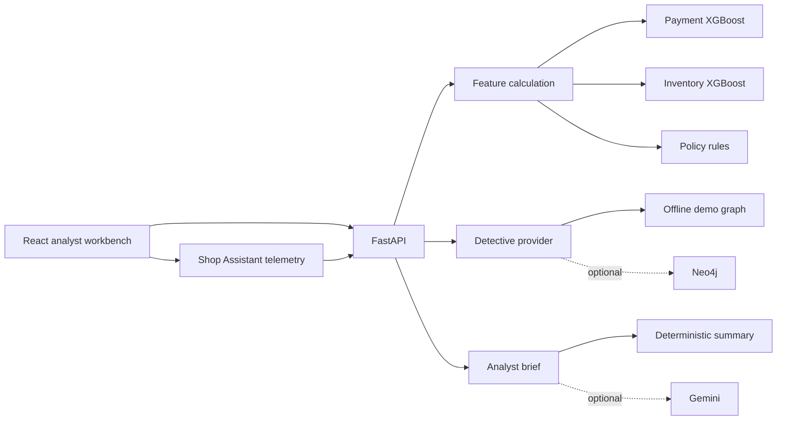

# Sentinel Travel Risk Lab

Sentinel is a working research prototype for explainable travel-booking risk assessment. It evaluates two separate risks:

1. payment fraud, such as use of a compromised payment token;
2. inventory abuse, such as repeated bulk holds followed by late cancellations.

The application combines XGBoost predictions, transparent policy rules, form-interaction telemetry, a relationship graph, and an optional Gemini analyst brief. It recommends **approve**, **manual review**, or **block**. It does not make production decisions.

> **Evidence boundary:** the included 15,000-row dataset is synthetic and reproducibly generated. Reported metrics verify the implementation on generated patterns; they are not claims about real travel-industry performance.

## Architecture



## Included Features

- **Gatekeeper:** separate payment-fraud and inventory-abuse XGBoost models plus policy guardrails.
- **Shop Assistant:** optional live capture of elapsed form time, paste count, and pointer events.
- **Detective:** interactive relationship graph with a labeled offline dataset and optional Neo4j provider.
- **Analyst assistant:** evidence-only local brief and optional Gemini generation that excludes booking and agent IDs.
- **Human review:** session case queue populated by completed assessments.
- **Evaluation:** chronological holdout, precision, recall, PR-AUC, ROC-AUC, false-positive rate, and confusion matrices.

## Requirements

- Python 3.11+
- Node.js 20+
- npm 10+

## Setup

From the repository root in PowerShell:

```powershell
python -m pip install -e ".\backend[dev,notebook]"
Set-Location frontend
npm install
Set-Location ..
```

To install optional Gemini and Neo4j clients:

```powershell
python -m pip install -e ".\backend[integrations]"
```

Do not commit API keys or database passwords. Copy values from [backend/.env.example](backend/.env.example) into environment variables only when those integrations are required.

## Train Reproducibly

```powershell
Set-Location backend
python -m ml.train
Set-Location ..
```

This regenerates the disclosed dataset when absent, trains both models with seed `20260823`, saves JSON model artifacts, and writes measured test metrics to [backend/artifacts/metadata.json](backend/artifacts/metadata.json).

## Run The Application

Terminal 1:

```powershell
Set-Location backend
python -m uvicorn app.main:app --host 127.0.0.1 --port 8000
```

Terminal 2:

```powershell
Set-Location frontend
npm run dev -- --host 127.0.0.1
```

Open `http://127.0.0.1:5173`.

## Optional Integrations

### Gemini

Set `GEMINI_API_KEY` and optionally `GEMINI_MODEL`. The implementation follows Google's current `google-genai` Interactions API and defaults to `gemini-3.7-flash`. Only scores and evidence labels are sent. When unavailable, the response provider becomes `offline_fallback`; it never pretends generation succeeded.

### Neo4j

Set `NEO4J_URI`, `NEO4J_USERNAME`, `NEO4J_PASSWORD`, and optionally `NEO4J_DATABASE`. Agent, device, payment, and IP nodes should expose `id`, `label`, `kind`, and `status` properties. Without a working connection, the graph provider is explicitly `offline_demo`.

## Verification

The complete normal-case, edge-case, screenshot, and model-improvement record is in [TESTS.md](TESTS.md).

```powershell
Set-Location backend
python -m pytest -q
Set-Location ..\frontend
npm test
npm run build
npm run lint
```

Execute the notebook:

```powershell
Set-Location ..
python -m jupyter nbconvert --to notebook --execute notebooks/model_evaluation.ipynb --output model_evaluation.executed.ipynb --output-dir notebooks --ExecutePreprocessor.kernel_name=travel-fraud-lab
```

## Measured Synthetic Test Results

| Model | Precision | Recall | PR-AUC | False-positive rate |
|---|---:|---:|---:|---:|
| Payment fraud | 0.7571 | 0.3706 | 0.4858 | 0.0082 |
| Inventory abuse | 0.8229 | 0.6320 | 0.6714 | 0.0172 |

The payment model misses many generated fraud cases at threshold `0.50`. That limitation is intentionally visible in the application and report.

## Submission Files

- [TESTS.md](TESTS.md): visual and automated test dossier with screenshot evidence
- [docs/architecture.md](docs/architecture.md): complete architecture, sequence diagrams, feature guide, and modeling explanation
- [docs/final_report.md](docs/final_report.md): implementation and evaluation report
- [docs/presentation.md](docs/presentation.md): slide-ready presentation
- [docs/demo_script.md](docs/demo_script.md): five-minute live demonstration
- [notebooks/model_evaluation.executed.ipynb](notebooks/model_evaluation.executed.ipynb): executed evaluation notebook
- [travel_fraud_research_roadmap.md](travel_fraud_research_roadmap.md): original research strategy with an evidence notice

## Safety And Limitations

- Never store raw card numbers; use payment-provider tokens.
- Geography, time of day, or telemetry must never independently prove fraud.
- SHAP contributions explain model influence, not causation or guilt.
- A real deployment requires lawful outcome data, leakage analysis, calibration, subgroup testing, retention rules, access control, drift monitoring, and human appeal processes.
