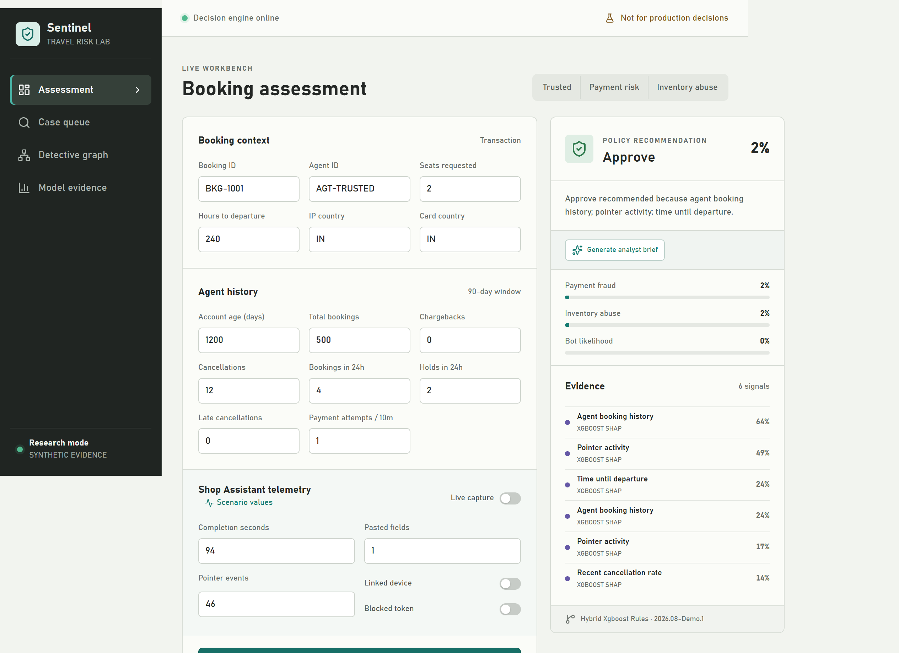
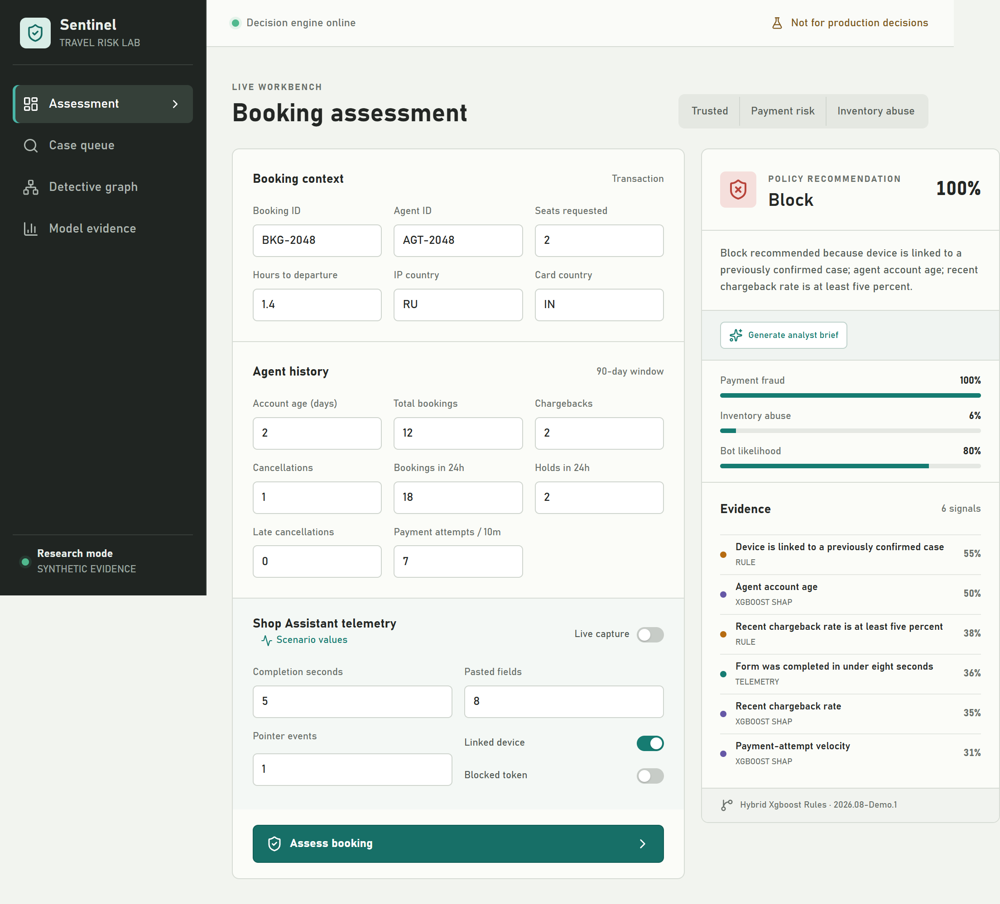
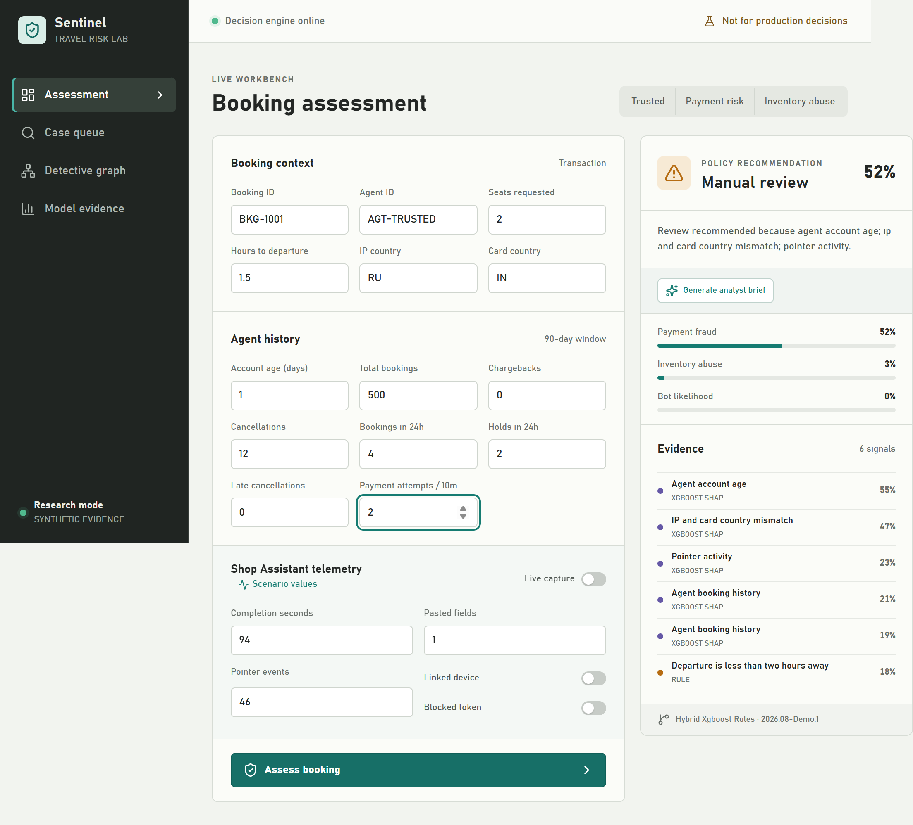
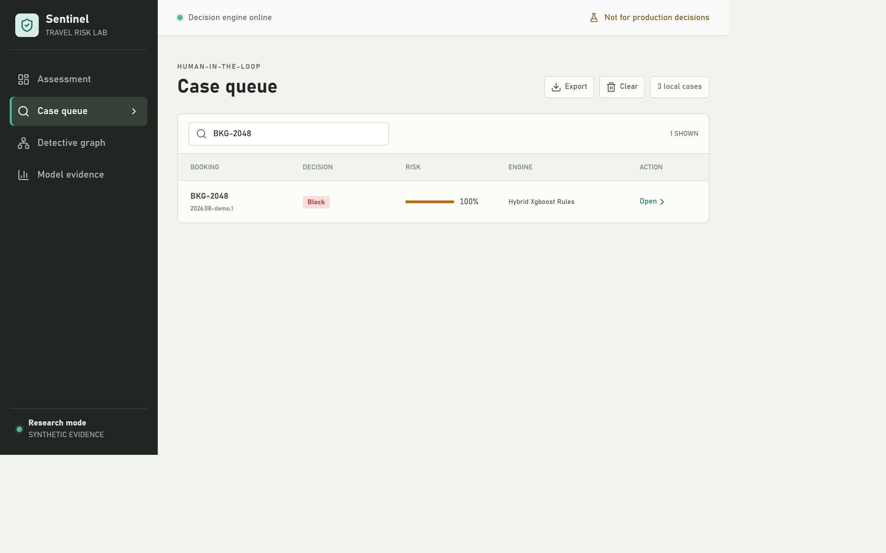
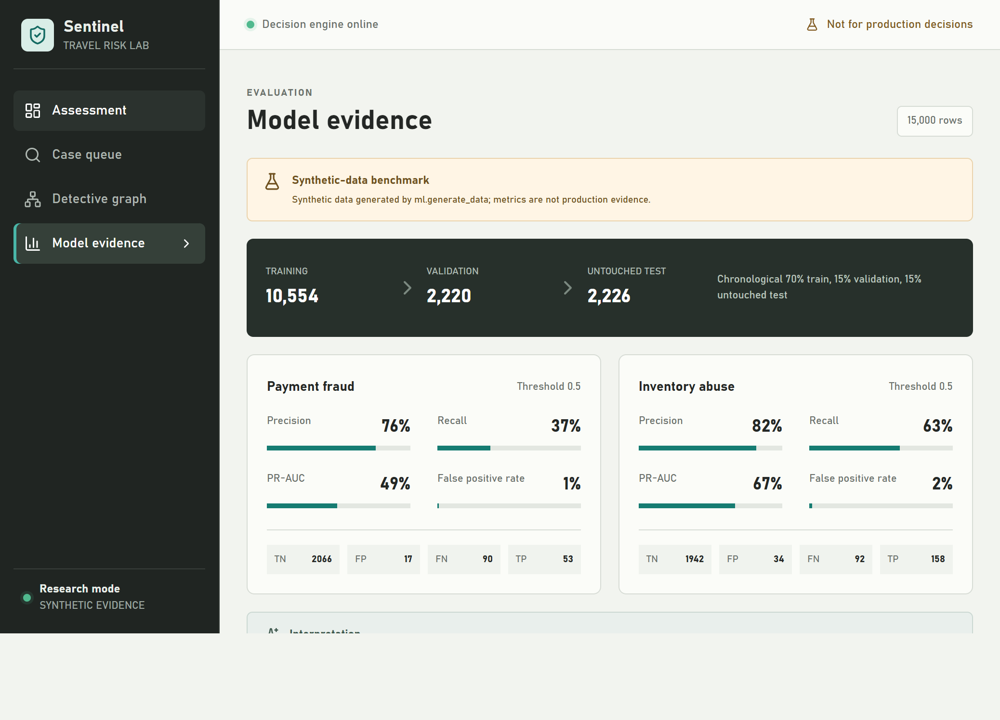
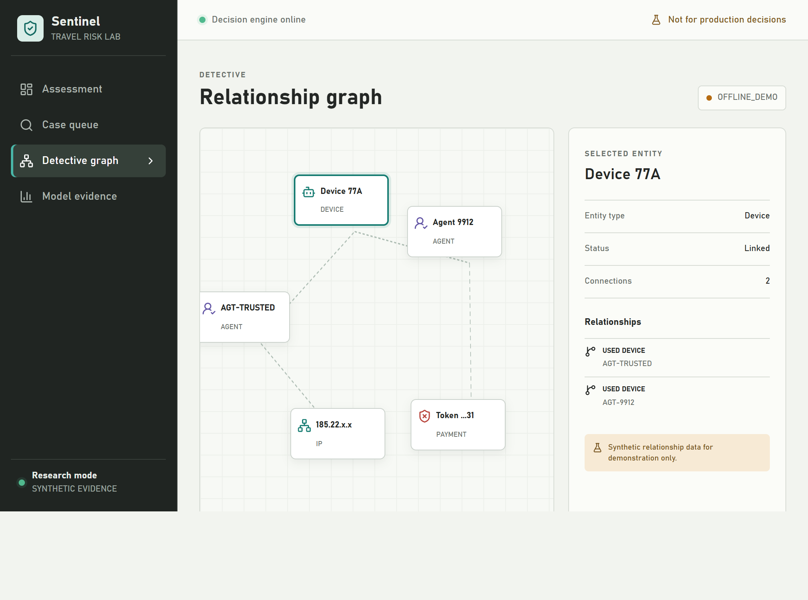
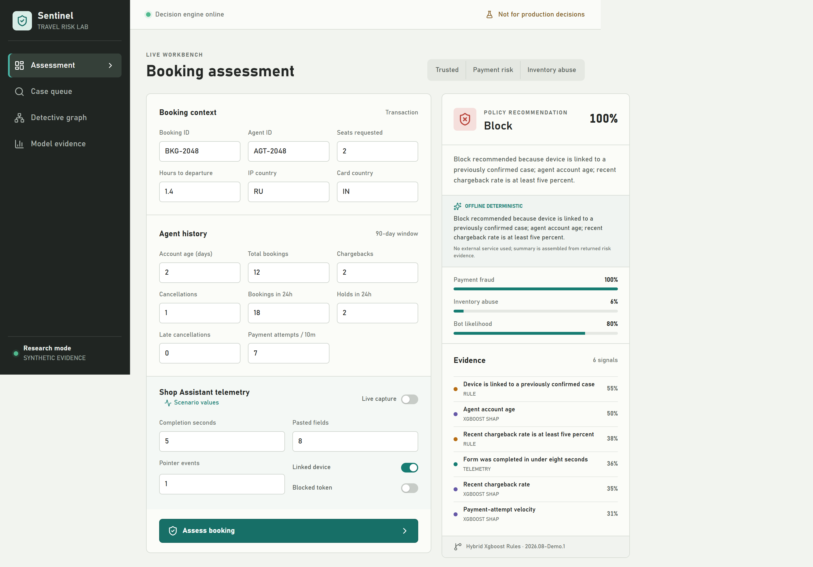
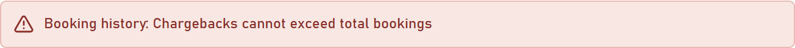
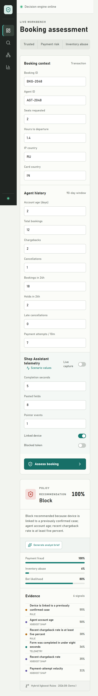

# Sentinel Test and Model Evaluation Report

**Execution date:** 23 August 2026  
**Environment:** Windows, Python 3.11, Node.js 24, Chromium  
**Purpose:** Record normal cases, edge cases, visual evidence, build quality, and honest model limitations.

> The dataset and graph fixtures are synthetic. Passing these tests verifies the prototype implementation. It does not prove production fraud-detection performance.

## Final Result

| Gate | Result | Evidence |
|---|---:|---|
| Backend/API/model automated tests | **17 passed, 0 failed** | [Backend JUnit XML](docs/test-results.xml) |
| Frontend UX and validation tests | **5 passed, 0 failed** | [Frontend JUnit XML](docs/frontend-test-results.xml) |
| Total automated tests | **22 passed, 0 failed** | Both JUnit files above |
| Frontend TypeScript production build | **Passed** | Vite transformed 1,813 modules |
| Frontend Oxlint | **Passed, 0 warnings** | `npm run lint` |
| Evaluation notebook | **Passed** | [Executed notebook](notebooks/model_evaluation.executed.ipynb) |
| Workspace diagnostics | **0 errors** | VS Code diagnostics check |
| Desktop visual workflows | **Passed** | Screenshots below |
| Narrow-mobile overflow check | **Passed** | Viewport width and scroll width both `342px` |

The refreshed backend suite completed in **3.04 seconds**; the frontend test command completed in **0.52 seconds**. The slowest backend test was the first model-backed assessment at **0.36 seconds**, which includes lazy artifact loading. A non-failing Starlette warning reports that its current `TestClient` compatibility path will be deprecated; application behavior was unaffected.

## Visual Normal Cases

### Test V1 — Trusted Booking

| Item | Value |
|---|---|
| Input | Established agent, matching countries, low velocity, no chargebacks |
| Expected | Approve |
| Observed | **Approve, 2% overall risk** |
| Status | **PASS** |
| Screenshot | [01-trusted-approve.png](docs/test-screenshots/01-trusted-approve.png) |



### Test V2 — Combined Payment Risk

| Item | Value |
|---|---|
| Input | New account, country mismatch, imminent departure, rapid attempts, linked device |
| Expected | Block |
| Observed | **Block, 100% payment risk, 80% bot likelihood** |
| Status | **PASS** |
| Screenshot | [02-payment-risk-block.png](docs/test-screenshots/02-payment-risk-block.png) |



### Test V3 — Inventory Abuse

| Item | Value |
|---|---|
| Input | 32 seats, 24 recent holds, 8 late cancellations, 48/90 cancellation history |
| Expected | Block inventory abuse without creating high payment risk |
| Observed | **Block, 100% inventory risk, 2% payment risk** |
| Status | **PASS** |
| Screenshot | [03-inventory-abuse-block.png](docs/test-screenshots/03-inventory-abuse-block.png) |


### Test V4 — Manual Review Band

| Item | Value |
|---|---|
| Input | One-day-old account, country mismatch, departure in 1.5 hours |
| Expected | Manual review, not automatic block |
| Observed | **Manual review, 52% payment risk** |
| Status | **PASS** |
| Screenshot | [10-manual-review.png](docs/test-screenshots/10-manual-review.png) |



### Test V5 — Persistent Analyst Queue

| Item | Value |
|---|---|
| Action | Create three cases, reload the page, search for `BKG-2048` |
| Expected | Cases survive refresh; one matching row; export enabled |
| Observed | **3 cases persisted, 1 shown, export enabled** |
| Status | **PASS** |
| Screenshot | [05-persistent-case-queue.png](docs/test-screenshots/05-persistent-case-queue.png) |



### Test V6 — Model Evidence View

| Item | Value |
|---|---|
| Expected | Synthetic disclosure, chronological split, both metric panels |
| Observed | **15,000 rows; 10,554/2,220/2,226 split; 2 models shown** |
| Status | **PASS** |
| Screenshot | [06-model-evidence.png](docs/test-screenshots/06-model-evidence.png) |



### Test V7 — Detective Relationship Graph

| Item | Value |
|---|---|
| Expected | Provider disclosure and selectable connected entities |
| Observed | **`offline_demo`, 5 nodes, Device 77A selected, 2 links** |
| Status | **PASS** |
| Screenshot | [07-detective-offline-graph.png](docs/test-screenshots/07-detective-offline-graph.png) |



### Test V8 — Offline Analyst Brief

| Item | Value |
|---|---|
| Expected | Deterministic evidence summary when Gemini is not configured |
| Observed | **Provider `OFFLINE DETERMINISTIC`; no external service used** |
| Status | **PASS** |
| Screenshot | [09-offline-analyst-brief.png](docs/test-screenshots/09-offline-analyst-brief.png) |



## Visual Edge Cases

### Test E1 — Impossible Historical Counts

| Item | Value |
|---|---|
| Input | 3 chargebacks but only 2 total bookings |
| Expected | Reject before scoring and show an actionable message |
| Observed | **HTTP 422; `Booking history: Chargebacks cannot exceed total bookings`; no result produced** |
| Status | **PASS** |
| Screenshot | [04-invalid-history-rejected.png](docs/test-screenshots/04-invalid-history-rejected.png) |



### Test E2 — Narrow Mobile Viewport

| Item | Value |
|---|---|
| Viewport | Requested `390 × 844`; browser content width `342px` after tool chrome |
| Expected | Full workflow available with no horizontal overflow |
| Observed | **Decision Block; `clientWidth = scrollWidth = 342px`** |
| Status | **PASS** |
| Screenshot | [08-mobile-payment-risk.png](docs/test-screenshots/08-mobile-payment-risk.png) |



## Automated Normal and Edge Tests

The exact machine-readable runs are stored in [docs/test-results.xml](docs/test-results.xml) and [docs/frontend-test-results.xml](docs/frontend-test-results.xml).

| # | Test | Type | Assertion | Result | Related screenshot |
|---:|---|---|---|---:|---|
| 1 | `test_low_risk_booking_is_approved` | Normal | Trusted booking is approved below review threshold | PASS | [V1](docs/test-screenshots/01-trusted-approve.png) |
| 2 | `test_multiple_payment_signals_require_review` | Normal | Moderate combined signals enter review band | PASS | [V4](docs/test-screenshots/10-manual-review.png) |
| 3 | `test_blocklisted_payment_is_blocked` | Normal/security | Blocklisted payment token forces block | PASS | [V2](docs/test-screenshots/02-payment-risk-block.png) |
| 4 | `test_invalid_history_is_rejected` | Edge | Chargebacks cannot exceed total history | PASS | [E1](docs/test-screenshots/04-invalid-history-rejected.png) |
| 5 | `test_model_metadata_discloses_synthetic_source` | Governance | Metadata labels synthetic source and both models | PASS | [V6](docs/test-screenshots/06-model-evidence.png) |
| 6 | `test_detective_graph_is_labeled_as_demo_data` | Governance | Offline graph never pretends to be Neo4j | PASS | [V7](docs/test-screenshots/07-detective-offline-graph.png) |
| 7 | `test_analyst_brief_uses_offline_evidence_without_key` | Integration | Missing Gemini key uses deterministic provider | PASS | [V8](docs/test-screenshots/09-offline-analyst-brief.png) |
| 8 | `test_local_vite_origin_is_allowed_by_cors` | Integration | Actual local frontend origin passes preflight | PASS | [V1](docs/test-screenshots/01-trusted-approve.png) |
| 9 | `test_inventory_abuse_signals_block_without_payment_risk` | Normal | Inventory abuse remains separate from payment risk | PASS | [V3](docs/test-screenshots/03-inventory-abuse-block.png) |
| 10 | `test_bot_telemetry_is_separate_from_payment_fraud` | Normal/bias | Bot-like telemetry does not inflate payment component | PASS | [V2](docs/test-screenshots/02-payment-risk-block.png) |
| 11 | `test_lowercase_country_code_is_rejected` | Edge/schema | Country codes must use two uppercase letters | PASS | [E1](docs/test-screenshots/04-invalid-history-rejected.png) |
| 12 | `test_zero_seats_is_rejected` | Edge/boundary | Seat quantity must be at least one | PASS | [E1](docs/test-screenshots/04-invalid-history-rejected.png) |
| 13 | `test_negative_history_count_is_rejected` | Edge/boundary | Historical counts cannot be negative | PASS | [E1](docs/test-screenshots/04-invalid-history-rejected.png) |
| 14 | `test_synthetic_generation_is_reproducible` | Model | Same seed produces identical rows | PASS | [V6](docs/test-screenshots/06-model-evidence.png) |
| 15 | `test_model_features_exclude_time_and_labels` | Model/leakage | Event day and labels cannot enter feature matrix | PASS | [V6](docs/test-screenshots/06-model-evidence.png) |
| 16 | `test_saved_metadata_matches_artifacts` | Model/artifact | Seed, features, row count, and model files agree | PASS | [V6](docs/test-screenshots/06-model-evidence.png) |
| 17 | `test_reported_metrics_are_bounded_and_confusion_counts_match_test_size` | Model/metrics | Metrics are valid and each matrix totals 2,226 | PASS | [V6](docs/test-screenshots/06-model-evidence.png) |
| 18 | `turns model-level booking history errors into plain language` | Frontend/UX | Removes framework wording and internal field names | PASS | [E1](docs/test-screenshots/04-invalid-history-rejected.png) |
| 19 | `humanizes field names when no explicit label exists` | Frontend/edge | Unknown snake-case locations still become readable labels | PASS | [E1](docs/test-screenshots/04-invalid-history-rejected.png) |
| 20 | `uses a safe fallback for malformed validation responses` | Frontend/resilience | Missing location and message cannot crash error rendering | PASS | [E1](docs/test-screenshots/04-invalid-history-rejected.png) |
| 21 | `identifies a loaded scenario and marks edited values as custom` | Frontend/UX | Preset state remains visible and manual edits become Custom | PASS | — |
| 22 | `formats useful history rates and impossible zero-history values` | Frontend/UX | Chargeback and cancellation context handles normal, empty, and invalid history | PASS | — |

## Trained Model Assessment

Results come from the newest untouched synthetic period of **2,226 rows**, using threshold `0.50`.

| Model | Precision | Recall | PR-AUC | ROC-AUC | False-positive rate | Improve? | Priority and reason |
|---|---:|---:|---:|---:|---:|---|---|
| Payment fraud | 0.7571 | 0.3706 | 0.4858 | 0.7758 | 0.0082 | **Yes** | **High.** It misses 90 of 143 generated positives. Tune thresholds against business cost, evaluate class weighting, calibrate probabilities, and validate on lawful real outcomes. |
| Inventory abuse | 0.8229 | 0.6320 | 0.6714 | 0.8443 | 0.0172 | **Yes** | **Medium.** Stronger synthetic baseline, but 92 of 250 positives are missed. Add temporal cross-validation and richer hold-release sequence features. |
| Bot likelihood | Not trained | Not trained | Not trained | Not trained | Not trained | **Yes, before production** | Current component is transparent rules only. A model needs consented, accessibility-reviewed interaction data and bot labels. |

### Recommended Improvement Order

1. **Obtain lawful real labels.** Synthetic metrics cannot answer whether the system works in a real portal.
2. **Optimize policy thresholds by cost.** Compare chargeback loss, inventory spoilage, analyst capacity, and false-positive partner harm.
3. **Raise payment recall carefully.** Test threshold reduction, class weights, and probability calibration while tracking false positives.
4. **Prevent entity leakage.** Use grouped chronological validation so the same agent, device, or payment token cannot leak across periods.
5. **Add delayed-label handling.** Chargebacks may arrive weeks after booking and must not be treated as immediate negatives.
6. **Evaluate bias and accessibility.** Telemetry, geography, and device signals require subgroup and assistive-technology tests.
7. **Shadow deploy before blocking.** Compare recommendations to analyst outcomes without affecting real travelers.

## UX Enhancements Verified During This Run

- The header now reports actual backend health instead of always showing green.
- Backend health has distinct checking, online, and offline states; offline assessment is disabled.
- Scenario controls show the active preset and switch to Custom when the analyst edits a field.
- Booking context shows country-match and departure-urgency signals before submission.
- Agent history shows chargeback and cancellation rates while editing.
- Impossible cross-field values are identified beside the relevant input before submission.
- Editing a value or changing telemetry mode clears stale server errors immediately.
- The case queue persists up to 50 cases across browser refreshes.
- Case search, JSON export, clear, and reopen actions work.
- API validation arrays are converted to readable field-level messages.
- Model-level validation now reads `Booking history: Chargebacks cannot exceed total bookings` instead of exposing Pydantic internals.
- Evidence list keys now include their component; browser testing found and fixed duplicate React-key errors.
- The interface remains restrained, operational, and visibly labels research/synthetic states.

## Reproduction Commands

```powershell
py -3.11 -m pytest backend/tests -q --durations=10 --junitxml=docs/test-results.xml
npm.cmd --prefix frontend test -- --reporter=junit --outputFile=../docs/frontend-test-results.xml
npm.cmd --prefix frontend run build
npm.cmd --prefix frontend run lint
python -m jupyter nbconvert --to notebook --execute notebooks/model_evaluation.ipynb `
  --output model_evaluation.executed.ipynb --output-dir notebooks `
  --ExecutePreprocessor.kernel_name=travel-fraud-lab
```

## Residual Limitations

- Gemini live generation was not tested because no secret API key was supplied; the tested offline fallback is shown above.
- A live Neo4j instance was not supplied; the tested provider explicitly reports `offline_demo`.
- Browser screenshots demonstrate Chromium behavior on this machine, not every browser or assistive technology.
- Production authentication, authorization, audit storage, encryption deployment, and monitoring remain outside this academic prototype.
