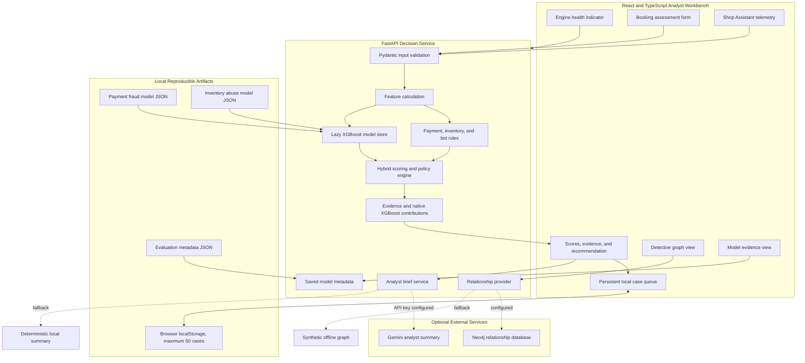
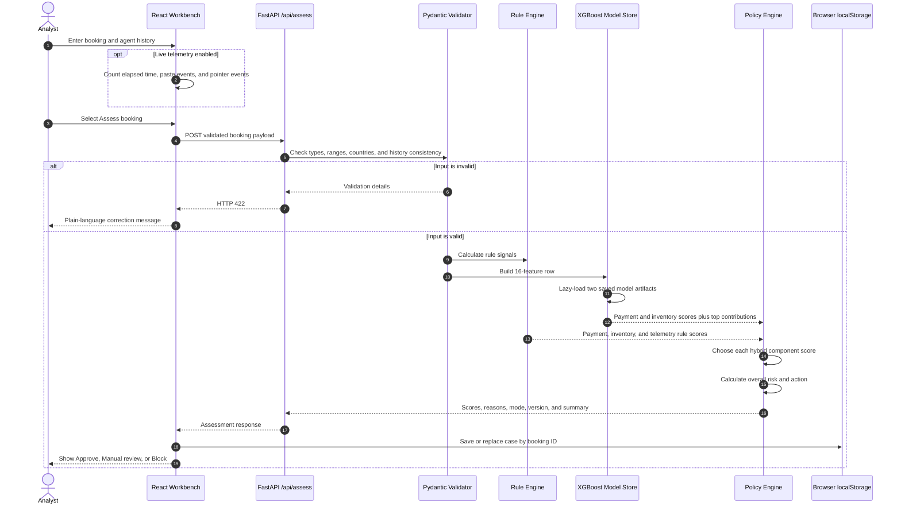
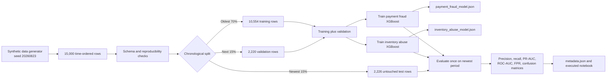
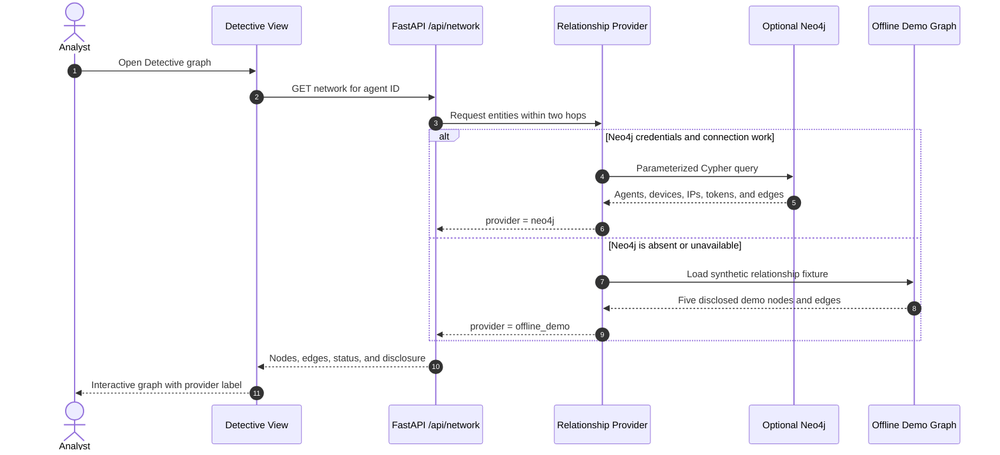
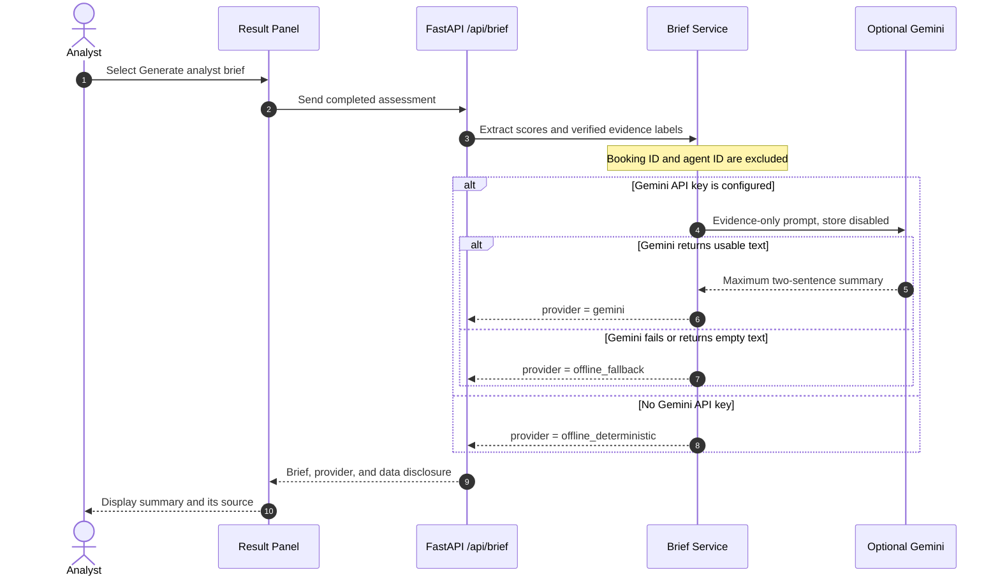

# Sentinel Architecture and Project Explanation

## 1. What We Built

Sentinel Travel Risk Lab is a working research prototype that checks a travel-agent booking before it is accepted. It looks for three different kinds of risk:

1. **Payment fraud:** signs that a payment or agent account may be connected to chargebacks or compromised payment activity.
2. **Inventory abuse:** signs that an agent may be holding many seats and cancelling them late.
3. **Bot-like behavior:** signs that a booking form may have been completed by automation rather than normal human interaction.

The system does not declare that a person is guilty of fraud. It returns a risk assessment and one of three recommendations:

| Overall risk | Recommendation |
|---:|---|
| Below `0.35` | Approve |
| `0.35` to below `0.80` | Manual review |
| `0.80` or above | Block |

A payment token on the configured demo blocklist also produces an immediate block. These thresholds are prototype policy settings, not production thresholds proven with real travel data.

## 2. System Architecture

### Architecture in simple terms

- The **frontend** is the screen used by an analyst. It collects booking information, displays scores, stores recent cases in the browser, and shows model evidence.
- The **FastAPI backend** validates the input and owns every risk decision. The browser does not invent a score.
- The **rule engine** catches clear, explainable patterns such as a blocklisted payment token, high payment velocity, or repeated late cancellations.
- The **two XGBoost models** learn nonlinear patterns for payment fraud and inventory abuse separately.
- The **policy engine** combines rule and model results into one recommendation.
- **Neo4j and Gemini are optional.** The application still works without them and clearly identifies the offline provider being used.

## 3. Booking Assessment Sequence

### What happens to the scores

For payment fraud and inventory abuse, Sentinel takes the larger of:

- the transparent rule score; or
- the relevant XGBoost model score.

The overall score is:

$$
\text{overall} = \max(\text{payment},\ \text{inventory},\ 0.6 \times \text{bot})
$$

This design avoids adding many correlated warnings together and accidentally creating a score above the intended range. Bot likelihood is discounted because fast form activity alone is weak evidence and can also be caused by autofill or accessibility tools.

## 4. Model Training Architecture

### Why there are two models

Payment fraud and inventory abuse are related business problems, but they are not the same outcome.

- A payment-fraud case may involve a compromised token, a linked device, country mismatch, rapid payment retries, or very short departure lead time.
- An inventory-abuse case may involve many seats, many recent holds, a high cancellation rate, repeated late cancellations, or unusual booking volume.

Training separate models keeps the meaning of each score clear and allows a future business to respond differently to each type of risk.

## 5. Data and Features

No lawful real booking dataset was supplied, so the prototype uses a clearly disclosed synthetic dataset. The generator creates 15,000 reproducible rows with a fixed seed.

The models use these 16 features:

| Group | Features |
|---|---|
| Agent history | Account age, total bookings, chargeback rate, cancellation rate |
| Velocity | Bookings in 24 hours, recent holds, payment attempts in 10 minutes |
| Inventory | Late cancellations, seats requested |
| Trip context | Hours until departure, country mismatch |
| Known links | Device linked to confirmed fraud, payment token on blocklist |
| Interaction | Completion duration, pasted fields, pointer events |

The labels are:

- `payment_fraud_label`
- `inventory_abuse_label`

The event day and labels are deliberately excluded from the model feature matrix to reduce direct leakage.

## 6. XGBoost Configuration

Both models use the same controlled configuration:

| Setting | Value |
|---|---:|
| Trees | 220 |
| Maximum tree depth | 4 |
| Learning rate | 0.045 |
| Row sampling | 0.85 |
| Column sampling | 0.85 |
| Minimum child weight | 4 |
| L2 regularization | 1.5 |
| Random seed | 20260823 |

XGBoost was chosen because it works well with structured tabular data, can model nonlinear interactions, runs without a GPU, and can expose per-prediction contribution values.

## 7. Model Explanation

When a model scores a booking, the backend also requests native XGBoost contribution values. It keeps the strongest positive contributors, maps internal feature names to readable labels, and returns them as `xgboost_shap` evidence.

For example, an analyst might see:

- Agent account age
- Recent chargeback rate
- Payment-attempt velocity
- IP and card country mismatch

These explain what influenced the model. They do not prove causation, criminal intent, or guilt.

## 8. Measured Synthetic Results

The results below come from the newest untouched synthetic period of 2,226 rows at classification threshold `0.50`.

| Model | Precision | Recall | PR-AUC | ROC-AUC | False-positive rate |
|---|---:|---:|---:|---:|---:|
| Payment fraud | 0.7571 | 0.3706 | 0.4858 | 0.7758 | 0.0082 |
| Inventory abuse | 0.8229 | 0.6320 | 0.6714 | 0.8443 | 0.0172 |

### What the results mean

- **Payment precision 0.7571:** about 76% of generated cases predicted as payment fraud were positive in the synthetic labels.
- **Payment recall 0.3706:** the model found only about 37% of generated payment-fraud positives. This is the largest model weakness.
- **Inventory precision 0.8229:** about 82% of generated inventory predictions were positive in the synthetic labels.
- **Inventory recall 0.6320:** the model found about 63% of generated inventory-abuse positives.
- **PR-AUC:** summarizes the precision/recall trade-off and is more useful than plain accuracy for an imbalanced fraud problem.

These results prove that the implementation and evaluation pipeline work on generated patterns. They do not prove real-world fraud performance.

## 9. Relationship Graph Sequence

The graph links agents to devices, IPs, and payment tokens. The current offline graph is intentionally marked synthetic. It never pretends to contain a real Neo4j result.

## 10. Analyst Brief Sequence

Gemini does not choose approve, review, or block. It can only summarize evidence after the policy engine has returned a result.

## 11. Frontend Features

### Assessment workbench

- Enter or edit booking, agent-history, trip, payment, and telemetry values.
- Load trusted, payment-risk, or inventory-abuse demonstration scenarios.
- See separate payment, inventory, and bot scores.
- See the policy recommendation and strongest evidence.
- Receive plain-language validation errors for impossible values.

### Shop Assistant telemetry

When live capture is enabled, the browser measures:

- elapsed form-completion time;
- paste events; and
- pointer events.

Telemetry is visible and optional. It is not hidden tracking in this prototype.

### Case queue

- Saves up to 50 completed assessments in browser `localStorage`.
- Replaces an older case when the same booking ID is reassessed.
- Supports search, reopen, JSON export, and clear.
- Survives a browser refresh on the same device.

This is convenient demonstration storage, not a production audit database.

### Model evidence

- Displays the synthetic-data disclosure.
- Shows chronological split sizes.
- Shows both model metric panels and confusion-matrix counts.
- Makes weak payment recall visible instead of hiding it behind accuracy.

### Health and research status

- The top bar checks `/api/health` and shows whether the decision engine is online.
- The interface permanently labels the system as research software using synthetic evidence and not for production decisions.

## 12. Backend Endpoints

| Endpoint | Purpose |
|---|---|
| `GET /api/health` | Report API health and whether models are loaded or rules-only mode is active |
| `POST /api/assess` | Validate and assess one booking |
| `GET /api/model` | Return saved training and test metadata |
| `GET /api/network/{agent_id}` | Return Neo4j or disclosed offline relationship data |
| `POST /api/brief` | Return a Gemini or deterministic analyst summary |

## 13. Validation and Safety Controls

The API rejects invalid data before scoring, including:

- negative history counts;
- zero seats;
- malformed country codes;
- chargebacks greater than total bookings; and
- cancellations greater than total bookings.

Other safety decisions include:

- no raw card numbers in the schema;
- no booking or agent IDs sent to Gemini;
- no silent claim that Neo4j or Gemini worked when they did not;
- no use of location mismatch or telemetry as independent proof of fraud;
- explicit synthetic-data and research-mode labels; and
- separate evidence sources for rules, telemetry, and XGBoost contributions.

## 14. Testing Completed

The project currently has:

- 17 passing backend, API, and model-pipeline tests;
- 5 passing frontend UX and validation-format tests;
- 10 visual workflow and edge-case screenshots;
- a clean TypeScript production build;
- a clean frontend lint run; and
- a fully executed evaluation notebook that recomputes the saved metrics.

The full evidence is in [TESTS.md](../TESTS.md).

## 15. What Must Improve Before Real Use

1. Replace synthetic labels with lawful, de-identified, time-stamped travel outcomes.
2. Group agents, devices, and tokens across data splits to prevent entity leakage.
3. Improve payment recall using threshold analysis, class weighting, and probability calibration.
4. Add delayed-label handling because real chargebacks may arrive weeks later.
5. Test fairness and accessibility, especially for geography and interaction telemetry.
6. Replace browser-only cases with authenticated, encrypted, durable audit storage.
7. Add production identity, authorization, monitoring, retention, and appeal workflows.
8. Shadow-test recommendations before allowing any automatic block.

## 16. One-Minute Explanation

Sentinel is a travel-booking risk assistant. An analyst enters a booking, and the backend checks whether the values are valid. It then runs transparent fraud rules and two XGBoost models: one for payment fraud and one for inventory abuse. A separate telemetry score looks for bot-like form behavior. The strongest component becomes the overall risk, and a policy recommends approve, manual review, or block. The screen explains which signals influenced the result, stores recent cases locally, can display linked agents and devices, and can generate a short evidence summary. The current data is synthetic, so the project demonstrates a complete and honest engineering pipeline rather than claiming proven production accuracy.