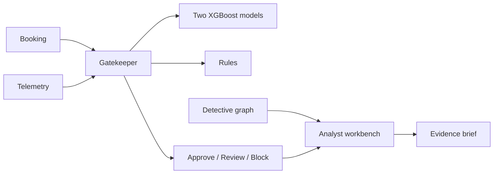

# Sentinel Travel Risk Lab: Presentation

## Slide 1 — Project

**Explainable AI for travel payment fraud and inventory abuse**

- Working full-stack research prototype
- Separate risk outcomes
- Human analyst remains in control

Speaker note: The project screens bookings before ticketing or prolonged inventory holding. It recommends an action; it does not declare guilt.

## Slide 2 — The Two Problems

- Payment fraud can create chargebacks after travel.
- Inventory abuse can hold seats or rooms and release them too late.
- One generic “fraud” label would hide different behaviors and outcomes.

Speaker note: We train and report two models because their labels, features, and operational responses differ.

## Slide 3 — Architecture

## Slide 4 — Gatekeeper

- Validated FastAPI request contract
- Payment and inventory models remain separate
- Rules provide visible guardrails
- Native XGBoost contributions explain score influence

Speaker note: The hybrid score is not presented as a calibrated probability.

## Slide 5 — Shop Assistant And Detective

- Opt-in completion time, paste count, and pointer events
- Telemetry remains a separate bot-likelihood signal
- Agent, device, IP, and payment-token relationship view
- Offline graph is labeled synthetic; Neo4j is optional

## Slide 6 — Analyst Assistant

- Deterministic evidence summary works offline
- Optional Gemini brief uses only scores and evidence labels
- Booking and agent IDs are excluded
- Provider and fallback status are shown in the UI

## Slide 7 — Honest Dataset

- 15,000 reproducible synthetic rows
- Fixed random seed: `20260823`
- Chronological 70/15/15 split
- Newest 2,226 rows form the untouched test period

Speaker note: Synthetic performance is not production evidence.

## Slide 8 — Measured Results

| Model | Precision | Recall | PR-AUC | FPR |
|---|---:|---:|---:|---:|
| Payment fraud | 75.7% | 37.1% | 48.6% | 0.82% |
| Inventory abuse | 82.3% | 63.2% | 67.1% | 1.72% |

Speaker note: Payment recall is a clear limitation. Reporting only accuracy would conceal it.

## Slide 9 — Safety And Bias

- Geography and time never prove fraud alone.
- Telemetry may reflect accessibility tools or autofill.
- No raw card numbers or personal identities are used.
- Production use requires audit sampling, appeals, retention rules, calibration, and subgroup tests.

## Slide 10 — Demonstration And Conclusion

1. Assess trusted booking.
2. Assess payment-risk booking and inspect evidence.
3. Generate provider-labeled analyst brief.
4. Explore Detective links.
5. Show untouched-test metrics.

**Conclusion:** a smaller honest system that works end to end is stronger than an unsupported production claim.
