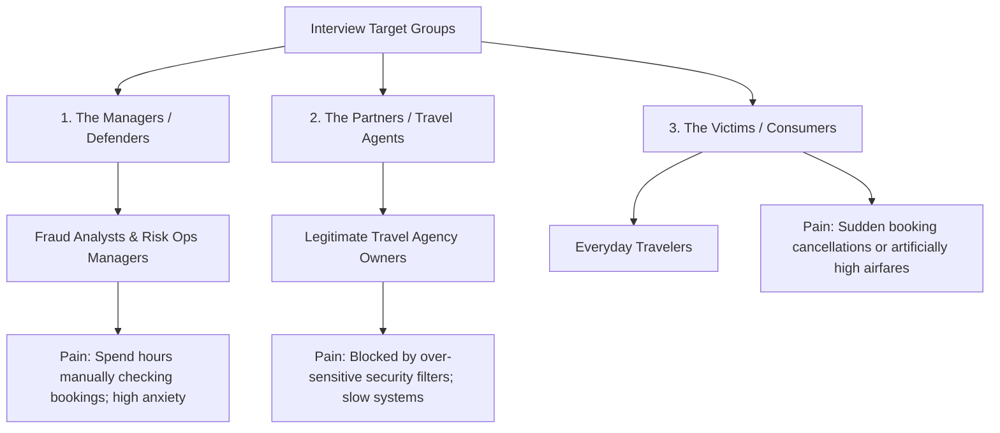

# Travel Agent Fraud & Fake Booking Detector: Simplified R&D Strategy
**Vertical:** Hospitality & Travel  
**Project Objective:** AI Opportunity Assessment & Transformation Blueprint  
**Tone:** Plain-English Business Strategy (Perfect for Team Presentations)

---

> [!IMPORTANT]
> ## Implementation and Evidence Notice — 23 August 2026
> A working implementation now exists in this repository. It includes two XGBoost models, a FastAPI service, a React analyst workbench, live telemetry capture, a provider-labeled relationship graph, and an optional Gemini analyst brief.
>
> The included dataset is **synthetic** and reproducibly generated. The measured untouched-test results are recorded in `backend/artifacts/metadata.json` and recomputed by `notebooks/model_evaluation.executed.ipynb`. These results verify the prototype pipeline; they do not prove real-world fraud performance.
>
> Numbers elsewhere in this original strategy such as “>98% accuracy,” fixed millisecond latency, operational savings, and analyst-time reduction are **hypotheses or targets**, not measured project findings. The implementation report in `docs/final_report.md` is the source of truth for delivered behavior, evidence, and limitations.

---

## Executive Summary
In the travel industry, "Travel Agent Fraud" is a major problem where bad actors abuse booking systems. This causes two massive issues:
1. **Inventory Spoilage (Room & Flight Clogging):** Bad actors block flight seats or hotel rooms without paying immediately, holding them hostage. If they can't resell them to customers at a profit, they cancel them at the last second. The airline or hotel is left with empty seats/rooms that they could have sold to genuine customers.
2. **Payment Fraud (Chargebacks):** Fraudsters use stolen credit cards to buy tickets through travel agent portals. By the time the real cardholder notices and disputes the charge, the travel is complete. The travel portal loses the money and has to pay heavy penalty fees (chargebacks) to the bank.

This project outlines how we can use **Artificial Intelligence** as a smart security team to stop this, saving money for travel companies and keeping prices fair for everyday travelers.

---

## 1. The Primary Research: Who Do We Interview?

We **do not** interview the criminals/fraudsters. Instead, we interview the **people suffering from the fraud or managing the consequences**. We divide them into three groups:

### The Three Interview Target Groups:
1. **The Fraud Operations Managers (The Defenders):** 
   * *Who they are:* People who work at Online Travel Agencies (OTAs) or Airlines checking for fake bookings.
   * *Why we interview them:* To ask how much money they lose to credit card disputes, how many bookings they have to check by hand, and what tools they currently use.
2. **Legitimate Travel Agents (The Portal Users):**
   * *Who they are:* Honest travel agents who book trips for clients using these portals.
   * *Why we interview them:* To ask if current security checks (like 2FA codes or booking limits) slow down their business. We want to make sure our AI doesn't make their life harder.
3. **End Consumers (The Travelers):**
   * *Who they are:* Everyday people booking flights and hotels.
   * *Why we interview them:* To see if they have ever had their ticket canceled at the gate because of an agency booking issue, or if they have noticed flight prices jumping suddenly due to "artificial demand" (clogging).

---

## 2. Research Questions & Discussion Framework

### Plain-English Research Questions
* **Q1:** How do travel portals currently decide if a booking is fake or real before they issue the ticket?
* **Q2:** What happens to a hotel or airline when a booking is held for 23 hours and then canceled at the last minute? How much money is lost?
* **Q3:** How do legitimate travel agents feel about current security checks? Do they find them annoying or slow?
* **Q4:** What are the most common signs of a fake booking? (e.g., booking at 3:00 AM, using a credit card from a different country, or booking 10 rooms at once?)

### Step-by-Step Team Discussion Framework
1. **Phase 1: Talk to Experts (Next 1 Week):** Conduct our interviews with travel agents or risk managers to verify that fake bookings are a genuine headache.
2. **Phase 2: Weigh the Options (Week 2):** Use a prioritization grid to prove why a "Fraud Detector" creates more business value than other projects (like a basic chatbot).
3. **Phase 3: Design the Solution (Week 3):** Outline how our "Smart AI Security Guard" works.
4. **Phase 4: Address Risks (Week 4):** Discuss how to protect user privacy and avoid accidentally blocking honest customers.

---

## 5. Detailed Explanations & Implementation Steps (FAQ)

### Q1: Are we detecting Bulk Bookings, Fake Bookings, or Both?
**Answer: We are detecting both, because they are two sides of the same coin.**
* **Bulk Booking (Inventory Clogging):** A rogue agent holds 50 flight seats for a group holiday without paying. If they fail to find buyers, they cancel them 2 hours before the flight. The booking itself was "legitimate" in the system, but the *intent* was fake.
* **Fake Booking (Payment Fraud):** An agent registers a booking using fake traveler credentials and a stolen credit card. 
* **The Connection:** Scammers often do both at once. They make bulk holds first (no cost), and then try to finalize the ticketing using compromised credit cards.

### Q2: Why are we discussing "Stolen Credit Cards"? Isn't that rare?
**Answer: Stolen credit card use is NOT rare; it is actually the single biggest fraud threat in the travel industry.**
Here is how the **Double-Agent Scam** works:
1. **The Setup:** A rogue agent creates a realistic travel website offering cheap flights.
2. **The Innocent Customer:** An everyday customer books a $1,000 flight through this rogue agent and pays them $900 in **cash**.
3. **The Fraud:** The rogue agent pockets the customer's cash. To secure the flight ticket, the rogue agent goes to the dark web, buys a stolen credit card, and books the flight on the airline's portal using the stolen card.
4. **The Consequence:** The customer gets their ticket and flies. A month later, the actual card owner notices the charge and reports it. The bank forces the airline to refund the $1,000. 

### Q3: How do we actually implement the "Gatekeeper" checks?
**Answer: We implement this using standard database checks when the agent clicks "Submit Booking."**
1. Read the travel agent's IP address and check a Geo-IP database to get the Country: "Russia".
2. Read the credit card's Bank Identification Number (BIN) to get the Issuing Country: "India".
3. Read the flight departure time and calculate time remaining: 1.5 hours.
4. Compare: If they mismatch and departure is imminent, the Gatekeeper halts the transaction.

### Q4: How do we implement the 4 AI members step-by-step?
1. **The Gatekeeper:** Build a checkout validation script to run logical security rules.
2. **The Shop Assistant:** Build a telemetry tracker on the booking form pages to measure typing/click millisecond intervals.
3. **The Detective:** Build a link relationship index mapping agent IDs to shared device configurations or bank details.
4. **The Auditor & Manager:** Deploy a semantic keyword classification model to read free-text logs and a GenAI engine to summarize the risk.

### Q5: What is the step-by-step Project Planning & Execution plan?
* **Phase 1: Planning & Data Scoping (Months 1–2):** Gather historical booking datasets and tag them (genuine vs. fraud).
* **Phase 2: Building the AI Models (Months 3–4):** Code and train the rule engines and machine learning classifiers.
* **Phase 3: Real-Time Execution (Month 5):** Integrate the models into the booking portal's checkout APIs.
* **Phase 4: Operational Integration (Month 6):** Deliver the GenAI Co-pilot interface for human analysts.
* **Phase 5: Continuous Training (Ongoing):** Feed human operational feedback back into the models to update fraud definitions.

---

## 6. Advanced AI Logic & Technical FAQ

### Q1: What if the flight leaves in > 2 hours? How do we differentiate genuine vs. fake?
**Answer: Departure time acts as a risk multiplier, and we combine it with the Agent's Trust History.**
* **The Imminent Flight (< 2 hours):** High urgency. A hacker knows that if they book a flight leaving in 1 hour, the ticket will be consumed before the real cardholder receives their bank statement. The system blocks or holds this instantly.
* **The Future Flight (> 2 hours):** Lower urgency. If the flight leaves in 2 weeks, we do not block the booking even if there is a location mismatch. Instead, we place a **temporary payment hold** and send an automated email verification request.
* **The Trust Score Counter-Weight:** We check the history of the travel agent account. If Agent "Aastha Travels" has been active for 3 years, has booked 1,000 tickets, and has **0 chargebacks**, their "Trust Score" is 100/100. This trust overrides the location mismatch. If it is a brand-new agent account created 2 hours ago, the mismatch is treated as high risk.

### Q2: How do we differentiate "Strange Time of Night" from a genuine late-night booking?
**Answer: We don't block bookings based on clock time. We look at deviations from normal profile habits.**
1. **Agent Behavior History:** If a travel agency normally operates between 9:00 AM and 6:00 PM, and suddenly logs in at 2:30 AM to make 20 bookings in rapid succession, this is a **profile deviation anomaly** (indicating their account password was stolen or hacked).
2. **Velocity (Volume per Minute):** A genuine traveler books **one** flight at 2:00 AM. A bot script books **50** flight holds in 3 minutes.
3. **Low Scoring Weight:** The time of day is never used alone to block a user. In the scoring math, booking at night is worth only a tiny fraction (e.g., 5 points out of 100).

### Q3: How does the 0-100 Risk Score work if one major rule is broken?
**Answer: We do not count rules. We use a Weighted Scoring Model trained via Machine Learning.**
* **High-Weight Rules (Major):** The credit card used is blacklisted for chargebacks $\rightarrow$ **Weight = 95 points**. Breaking this single rule pushes the score to 95/100, causing an immediate block.
* **Low-Weight Rules (Minor):** The booking was made at 3:00 AM $\rightarrow$ **Weight = 5 points**. The agent is booking a popular route $\rightarrow$ **Weight = 10 points**.
If a user books a flight at 3:00 AM on a popular route, they only score 15/100. This is approved.
* **How weights are decided:** We use an ML algorithm called **XGBoost**. We feed it 100,000 past bookings. The algorithm calculates the mathematical correlation of each feature to historical fraud, automatically setting the weights.

### Q4: How exactly do we train the Gatekeeper on past data patterns?
**Answer: Supervised learning on historical database sheets.**
1. **Data Prep:** We export a database containing features (booking time, IP location, card country, lead time) and a label (`1` for past credit card chargebacks/fraudulent holds, `0` for successful travel).
2. **Feeding the Model:** We feed 80% of this data into the XGBoost algorithm. The model analyzes the rows to find mathematical correlations.
3. **Testing:** We run the remaining 20% of our past data through the model to see if it correctly predicts the historical fraud labels. Once accuracy hits >98%, the model is ready.

### Q5: How do we build the Detective Network Graph?
**Answer: Using a Graph Database to link shared device, card, and email entities.**
1. **How it links:** Every time a travel agent logs in, we log their Account ID, Device ID (computer fingerprint), Credit Card used, and Phone Number.
2. **Catching the ring:**
   * Agent Account 1 commits card fraud and is **Banned**.
   * The Graph Database records that Agent Account 1 used `Device ID: XYZ789`.
   * The next day, a new account, **Agent Account 2**, registers with a different name and email. 
   * When Agent Account 2 logs in, our Graph database checks if their device has been seen. It instantly alerts: *"Agent 2 is logging in from Device ID: XYZ789, which is linked to the Banned Agent 1."*
   * The system links the new account to the fraud cluster and blocks it before it can book a flight.

### Q6: Why do we split the historical data 80% / 20%?
**Answer: To ensure the AI actually learns patterns, rather than just memorizing answers.**
* **The Exam Analogy:** We hide 20% of the past bookings (Validation Set) and train the model on the other 80% (Training Set). Once the model is ready, we test it on the hidden 20% to check its real-world performance without memorization bias.
* **Why 80/20:** It is the standard industry sweet spot for medium databases.

---

## 7. Deep-Dive Planning & Execution Guide (Phases 1-5)

### Phase 1: Planning & Data Scoping (Months 1–2)
1. **Data Connection:** Connect analysis environment to the databases.
2. **Data Extraction:** Pull past transaction logs.
3. **Labeling:** Cross-reference logs with bank chargebacks and label them.

### Phase 2: Building the AI Models (Months 3–4)
1. **Gatekeeper:** Train XGBoost classifier.
2. **Shop Assistant:** Deploy telemetry tracker script.
3. **Detective:** Map agent relationships in Neo4j.
4. **Scoring:** Calibrate final scores.

### Phase 3: Real-Time Execution (Month 5)
1. **API Hooking:** Add security checks in backend checkout.
2. **API Call:** Send JSON payload to engine.
3. **Real-time Assessment:** Calculate score.
4. **Actions:** Score <30 = Approve, 30-79 = Hold for human review, >=80 = Block.

### Phase 4: Operational Integration (Month 6)
1. **Dashboard:** Build analyst verification queue UI.
2. **GenAI Co-pilot:** Deploy Gemini to summarize risk flags.
3. **Auto-Communication:** Draft verification request emails.

### Phase 5: Continuous Training (Ongoing)
1. **Log Action:** Log human analyst approvals and cancellations.
2. **Update Dataset:** Weekly sync of human decisions.
3. **Retrain:** Weekly training runs to stay ahead of new scams.

---

## 8. Deep-Dive Fraud Mechanics: Bulk Booking vs. Card Fraud

### A. Summary Table
| Metric | Bulk Booking Fraud (Inventory Abuse) | Fake Credit Card Fraud (Payment Fraud) |
| :--- | :--- | :--- |
| **WHAT it is:** | Holding room/seat inventory for free without payment, then canceling at the last second. | Buying tickets using stolen credit card numbers from the dark web. |
| **WHY they do it:** | To hoard popular travel dates, force prices up, or try to resell them on secondary sites for a markup. | To get tickets, resell them to real customers for clean cash, and pocket the cash. |
| **HOW we detect it:** | Looking at cancellation patterns, booking intervals, and email domain structures. | Looking at geographical mismatches, transaction velocity, and bank origin codes. |

---

## 9. Technical & Architectural Justifications (Why This Stack?)

A common board question is: **Why are we using these specific technologies (XGBoost, Web Telemetry, Neo4j, GenAI) side-by-side? Why not just one single system?**

We use a **defense-in-depth architecture**. Each tool is selected because it excels where the others fail.

### 1. Why XGBoost (for transaction metadata) vs. Alternatives?
* **The Alternative:** Hardcoded Rules (IF-THEN statements) OR Deep Neural Networks.
* **Why XGBoost:** 
  * Hardcoded rules are static; scammers bypass them within days by shifting variables. 
  * Deep Learning is a "black box"—it is slow, requires expensive GPU hardware, and cannot explain *why* it blocked a ticket.
  * **XGBoost** runs in under **10 milliseconds**, runs on standard cheap servers, and provides **feature importance** (meaning we can see exactly which rules drove the risk score).

### 2. Why Web Telemetry (for speed tracking) vs. Alternatives?
* **The Alternative:** Relying purely on payment gateway data.
* **Why Telemetry:** Sophisticated fraudsters purchase real credit cards and type valid names. However, they use automated scripts to process bookings at scale. 
  * The API receives transaction requests that look normal.
  * By tracking the **interaction physics** (how many milliseconds are spent on each form box), we can identify bot behaviors that are impossible for humans to duplicate.

### 3. Why Neo4j Graph DB (for connection mapping) vs. SQL Databases?
* **The Alternative:** Standard Relational Tables (SQL).
* **Why Neo4j:** Scammers create dozens of clean agent accounts to hide volume.
  * SQL databases are designed for flat rows. Tracing connections (e.g. *Agent 1 shares IP with Agent 2, who used Credit Card B, which was used by Agent 3 on Device C*) requires multiple slow, heavy "JOIN" queries that can crash database servers during peak booking times.
  * **Neo4j** stores connections as relationships directly. Tracing a 5-step network path takes **under 5 milliseconds**, letting us block new burner accounts linked to old banned entities instantly.

### 4. Why Google Gemini (for GenAI Co-pilot) vs. Raw Scores?
* **The Alternative:** Just showing analysts a number (e.g. "Risk Score: 76/100").
* **Why Gemini:** A raw score tells an analyst *nothing* about what to check. They must spend 15 minutes checking 5 different databases to verify the card, location, and device history.
  * **Gemini** reads the scoring data and graph links and instantly summarizes the case: *"We held this booking because the agent logged in from Moscow using an Indian credit card to book a flight departing in 1 hour. This card was associated with a chargeback on a different agent account last week."*
  * This saves human manual review time, reducing it from **15 minutes per ticket to 30 seconds**.

---

## 10. Value Creation Logic (Who Wins?)

This architecture creates a direct **win-win** loop for both the platform company and the end consumer:

### A. How it helps the Travel Company
1. **Direct Cash Preservation:** Blocks stolen card transactions *before* ticketing. This directly reduces chargebacks (saving the $1,000 ticket value plus the $15–$50 chargeback processor fine).
2. **Inventory Optimization:** Releasing fake bulk holds early ensures rooms and seats are sold to genuine travelers at peak dynamic prices, increasing RevPAR (Revenue Per Available Room).
3. **Operational Leverage:** Reduces the number of security analysts needed. The system automatically handles 98% of bookings, leaving only the complex 2% borderline cases for humans.

### B. How it helps the Everyday Traveler (Consumer)
1. **Price Protection:** When bots hold 50 flights, the airline's dynamic algorithm thinks demand is soaring and spikes the price. By releasing fake holds instantly, pricing stays natural and fair.
2. **Preventing Gate Rejections:** Everyday travelers sometimes purchase cheaper tickets from third-party agents, only to find the ticket has been canceled at the airport counter because the agent used a stolen card. Shuts down fake agents before they can sell scam tickets.
3. **Frictionless Experience:** Legitimate travel agents with high historical trust scores bypass annoying security verifications, ensuring fast checkouts for travelers.

---

## 11. Understanding AI Bias & Fair Mitigation Strategies

When proposing an AI system, analyzing algorithmic bias is critical. Below, we map out how the **6 core types of AI bias** apply to our travel fraud detector and how our team will mitigate them.

> [!WARNING]
> ### The Primary Operational Threat: Feedback Loop Bias (Confirmation/Selection Bias)
> Out of all six biases, **Feedback Loop Bias** is the single most destructive and common threat to a live production fraud model. 
> 
> Because the system auto-approves low-risk transactions without human audit, the model never receives feedback on missed frauds inside the "approved" group. The AI will continue to believe that any fraud pattern scoring <30 is 100% genuine, reinforcing its own blind spot. Over time, the model's accuracy decays drastically as scammers discover and exploit this loophole. Enforcing a **Random Audit Policy** (randomly checking 1% of approved bookings) is the only way to mitigate this primary bias.
> 
> **The Essay Grading Analogy:**
> Imagine a teacher grading essays. The teacher scans a stack of 100 essays. If an essay has messy handwriting, the teacher reads it line-by-line and corrects spelling mistakes. If the essay has neat handwriting, the teacher automatically marks it "Approved" and files it away without reading it. 
> 
> In this setup, one student discovers they can copy and paste essays from Wikipedia as long as their handwriting is neat. Their plagiarism is never caught. Over time, the teacher's training data on student spelling mistakes becomes completely **biased**; they believe spelling mistakes only exist in messy handwriting, creating a massive blind spot for neat-looking plagiarism. 
> 
> In our project, "neat handwriting" represents a transaction that scores <30. The AI auto-approves it, and if it was actually a clever scam, the AI never reads it or learns from it.

### 1. Historical Bias
* **Definition:** Bias originating from historical prejudices or inequalities present in past data.
* **Mitigation:** We limit training data weight to recent patterns (e.g., last 12 months) and apply decay weights to older records, allowing the AI to forget outdated historical trends.

### 2. Representation & Sampling Bias
* **Definition:** Bias occurring when the development dataset does not represent the real-world operational user population.
* **Mitigation:** We implement a stratified sampling strategy during Phase 1 to ensure that transactions from smaller travel operators and local accommodation providers are proportionally represented in our training dataset.

### 3. Proxy Management Bias
* **Definition:** Bias introduced when an easily measurable variable is used as a stand-in (proxy) for a complex, hard-to-measure concept.
* **Mitigation:** The location mismatch is never allowed to make a decision alone. The model must verify it against the agent's **historical trust score** and device fingerprint before taking action.

### 4. Annotation & Human-in-the-Loop Bias
* **Definition:** Bias introduced during the human labeling process (ground truth generation).
* **Mitigation:** We enforce strict double-annotation rules (two analysts must agree on a fraud label for training) and use clear, objective criteria (like bank chargeback dispute forms) as labels, rather than analyst intuition.

### 5. Aggregation Bias
* **Definition:** Bias occurring when a single general model is applied to a heterogeneous (mixed) user population, ignoring sub-group characteristics.
* **Mitigation:** We split the model into distinct sub-group pipelines, evaluating corporate booking portal traffic under a dedicated business traveler schema.

### 6. Feedback Loop & Deployment Bias
* **Definition:** Bias resulting from the model's own real-world actions influencing the future data it collects.
* **Mitigation:** Enforce a **Random Audit Policy** where 1% of auto-approved bookings are manually checked.

---

## 12. Primary Research: Interview Questions & Simple Responses

This section provides ready-to-use primary research interview scripts and expected answers written in simple terms, perfect for your project files.

### Group 1: Fraud Operations Managers (The Portal Defenders)
* **Q1: What is the biggest headache you face when booking volume spikes (like holiday season)?**
  * *Simple Answer:* "Fake holds or bulk bookings. Scammers reserve 50 seats or hotel rooms for free, and then cancel them at the last second when they can't resell them. We end up with empty planes or rooms that we could have sold to real, paying customers."
* **Q2: Why is credit card fraud such a massive financial threat to your portal?**
  * *Simple Answer:* "When a rogue agent uses a stolen credit card to buy a ticket, the real cardholder disputes the charge. The bank forces us to refund the full money (a chargeback) and pay a penalty fee. We lose both the ticket value and extra cash."
* **Q3: What is wrong with the current tools you use to check bookings?**
  * *Simple Answer:* "They are too manual. The filters flag too many legitimate bookings, forcing our analysts to inspect them by hand. This slows down booking times, frustrates honest travel agents, and wastes staff hours."

---

### Group 2: Legitimate Travel Agents (The Portal Users)
* **Q1: How do security check filters on travel portals affect your daily business?**
  * *Simple Answer:* "They slow us down. If a customer is waiting on the call, and the portal locks my account or requires 3 separate phone OTP checks just because I am booking from a different location, I might lose the sale."
* **Q2: Have you ever had a genuine client booking blocked by mistake?**
  * *Simple Answer:* "Yes. I booked a last-minute flight for a business client traveling abroad. Because the flight was departing soon and paid with an international card, the system blocked it, assuming it was fraud. I had to wait hours for support to unlock it, nearly missing the flight."

---

### Group 3: Everyday Travelers (The End Consumers)
* **Q1: Have you ever faced any booking issues when purchasing tickets through third-party agents?**
  * *Simple Answer:* "Yes. I bought a cheap ticket online, but when I arrived at the airport check-in desk, the airline said my ticket was canceled because the agent used a stolen credit card to book it. I was stranded and had to buy a new ticket at full price."
* **Q2: Do you notice flight or hotel prices changing suddenly when searching online?**
  * *Simple Answer:* "Yes, prices jump up suddenly within hours. I learned that this happens because bots make fake booking holds to artificially spike the demand, driving prices up for normal travelers."

---

## 13. Detailed Interview Guide: Deep-Dive Pain Point Questions

Use these targeted question sheets during your actual stakeholder interviews. They are designed to extract specific, quantitative and qualitative data to prove your project's business case.

### A. Interview Script: Fraud Operations Managers (e.g., at Infosys Risk Ops Hubs)

* **Q1 (The Baseline):** "Which travel portals or airline ticketing backends do your teams manage security and risk verification operations for?"
* **Q2 (The Costs):** "Could you estimate the typical monthly financial loss a mid-tier portal faces from payment chargebacks compared to seats lost due to last-minute bulk cancellations?"
* **Q3 (Manual Review Burden):** "What is the size of your manual verification team, and what is the typical backlog size (number of held tickets waiting for human eyes) during peak booking seasons?"
* **Q4 (The Bottlenecks):** "When an analyst manually reviews a flagged booking, what is the most time-consuming step? (e.g., checking device logs, checking card databases, or searching historical agent records?)"
* **Q5 (False Positive Costs):** "How do you calculate the cost of a 'False Positive' (blocking an honest travel agent by mistake)? Do you track how many of these blocked partners stop using your client's portal as a result?"
* **Q6 (Adaptability Cycle):** "When your engineering team deploys a new security filter or rule, how long does it take for professional fraud networks to adjust their behavior and bypass it?"
* **Q7 (Automation & Bots):** "Are you seeing an increase in bot-based ticket hoarding (scripts booking seats instantly at release times), and how does your team currently differentiate a human travel agent using a fast portal from a machine?"
* **Q8 (Explainability Gap):** "When your current automated rules flag a booking, does the system explain *why*? How often do human analysts disagree with the automated flag but feel forced to uphold it due to company policy?"
* **Q9 (Operational Fatigue):** "During peak hours, how does analyst fatigue affect the error rates (e.g., approving fraud by mistake or blocking a genuine VIP agent)?"

---

### B. Interview Script: Legitimate Travel Agents (The Portal Users)

* **Q1 (Operational Friction):** "On average, how many travel portals (OTAs/Airlines/GDS) do you use daily, and which ones have the most frustrating security layers?"
* **Q2 (Security Blocks):** "What specific security prompts (e.g., multi-factor authentication, account lockouts, card verification holds) do you encounter most frequently, and how many minutes do they add to a booking?"
* **Q3 (The Lost Sale):** "Have you ever experienced a situation where a client walked away or decided not to book with you because the travel portal held the ticket transaction pending security verification?"
* **Q4 (Last-Minute Bookings):** "For corporate business clients, bookings are often made last-minute (e.g., flight in 4 hours). Have you ever had such an urgent ticket blocked by a portal's automated fraud engine? What was the outcome?"
* **Q5 (International Bookings):** "When booking travel for international clients using credit cards issued in different countries, does the platform frequently trigger fraud blocks? How do you bypass this?"
* **Q6 (Customer Support Drag):** "When a booking is flagged or held, what is the process to resolve it? How long do you have to wait on support lines to get a human analyst to approve the ticket?"
* **Q7 (Mistakes & Typos):** "If you make a spelling error in a client's passenger name and try to correct it or re-book immediately, does the system flag your account for suspicious activity?"
* **Q8 (Competitor Advantage):** "Would you accept a slightly lower commission rate on a portal that offers instant, smooth checkouts with zero security checks over a portal that pays higher commissions but frequently holds your bookings?"
